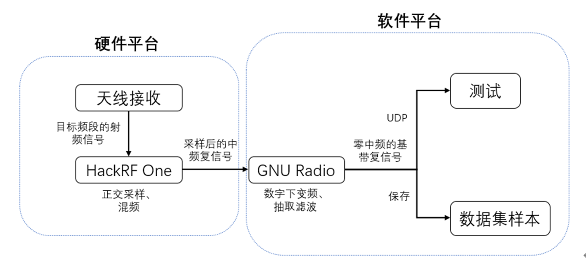
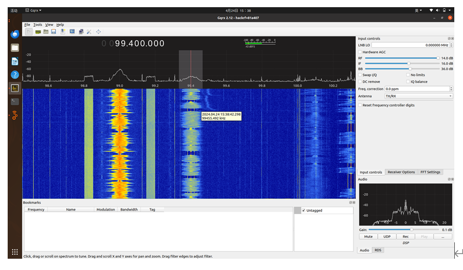
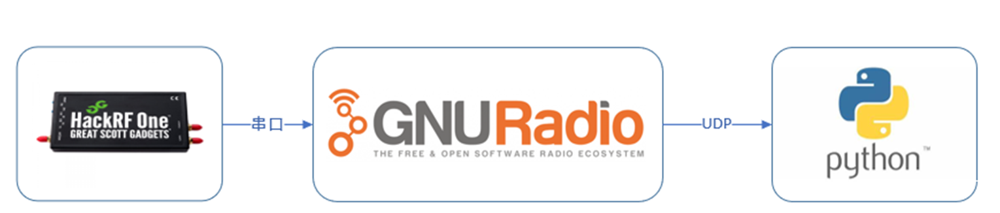
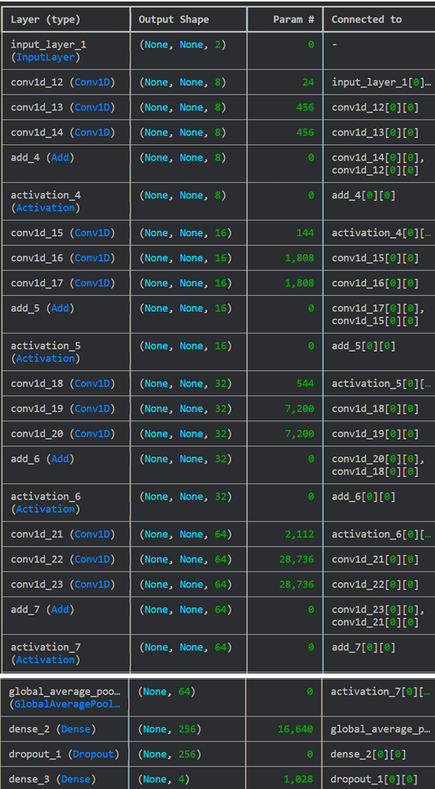
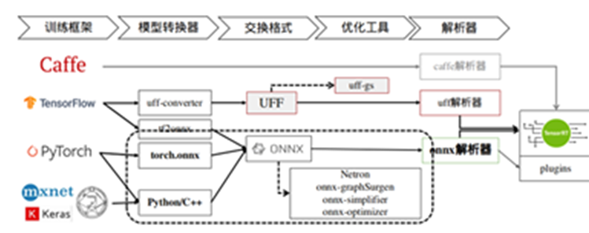
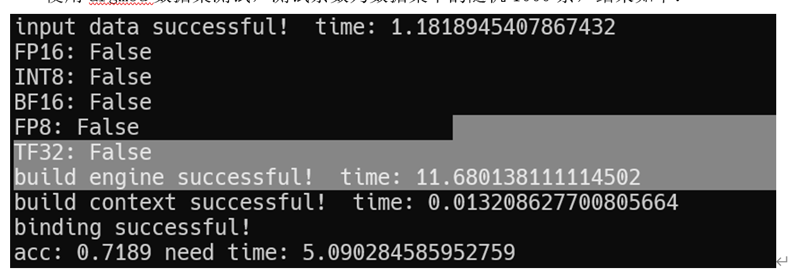
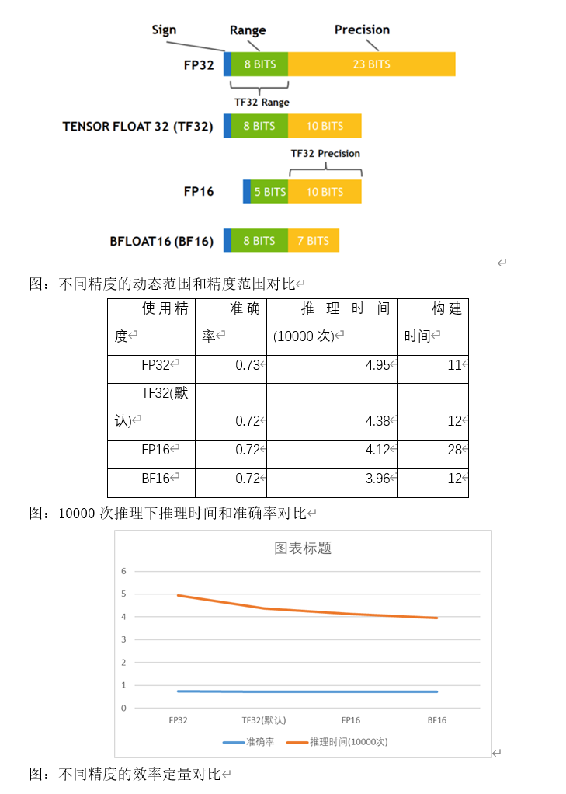
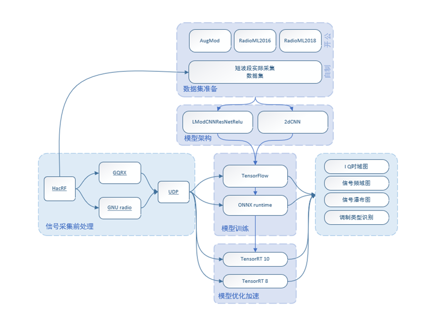
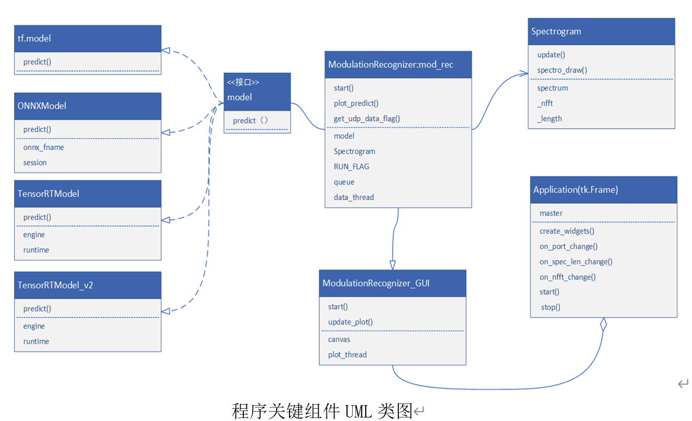

# 基于NVIDIA TX2与深度学习的信号调制识别与嵌入式Tensorrt推理加速

（具体项目实现见项目文档，本项目不可做商业用途）

# 1.项目概述

随着无线通信技术的迅速发展，通信系统中采用了多种复杂的调制方式。调制识别作为无线通信领域的一个重要问题，对于信号分析、频谱管理以及安全监测具有重要意义。传统的调制识别方法往往依赖于专业领域知识和手工设计的特征提取器，而基于深度学习的调制识别方法则能够自动地学习信号的特征，具有更好的泛化能力和适应性。

本课题使用HackRF One无线电接收模块进行信号接收，通过PC模型训练，并且使用NVDIA嵌入式开发板jetson nano进行模型部署与进一步的加速优化，从而实现本项目的调制识别的功能。本项目旨在完成产品化，并且加深对于信号调制、信号接收、模型构建部署等流程的了解。

该课题的核心问题在于如何利用深度学习技术结合HackRF One无线电接收模块实现对无线通信中的调制方式进行准确识别。包括如何获取真实的无线信号数据，并对其进行预处理（信号采样、去噪、归一化等），以便于深度学习模型的训练和识别；如何设计适用于调制识别的深度学习模型与针对调制识别任务的损失函数和评价指标；如何将训练好的模型导出并且部署到嵌入式平台上以及如何利用NVDIA的优势进行推理加速等附加功能。

本项目实现了对无线电数据的采集，数据集的制作与相应的模型训练，实现了对实际信号的识别；推理端实现了tensorRT加速并且利用精度选择进行模型优化，达到了预期效果。

# 2.信号接收方案

针对现在实际的应用，需要对不同的无线电信号的调制方式进行精确的识别，此次项目针对的信号主要为短波频段（3—30MHz）、广播频段（87.5-108MHz）以及业余开放频段（433MHz）。在信号接收时应能实现对给定频点的信号的实时接收、处理和记录。此外还应能够通过处理得到信号的相关特征（时域波形、频谱、时频域等），初步判断信号的调制类型，并与最终模型的识别结果相验证。

信号采集部分采用了两种方案，一是采用HackRF One的硬件和GQRX、GNU Radio软件；二是采用RTL-SDR硬件和SDR#软件进行信号的实时接收和保存32位的IQ路数据。

 

# 3.深度学习模型方案

在模型设计方面，我们使用TensorFlow等框架对深度学习模型搭建VT-CNN2和LModCNNResNet Relu模型，LModCNNResNet Relu模型主要从参数量级和测试效果来考虑，它的效果优于之前开发的模型，它利用卷积层和残差连接结构，结合 ReLU 激活函数、全局平均池化层和 Dropout 正则化等技术，能够高效地从时频图像中提取特征，对信号调制方式进行准确识别。通过合适的参数初始化策略，该模型具备较强的泛化能力，能够适应不同信号条件下的识别任务，为信号处理领域提供了一种有效的解决方案。对于VT-CNN2 模型，它通过卷积神经网络结构设计，能够高效地从数字调制信号的时频图像中提取特征，实现自动化、准确的调制方式识别。其设计考虑了多种调制类型的特征提取和鲁棒性，通过零填充和 Dropout 正则化等技术，提高了模型对噪声和干扰的容忍度，使其具备较强的泛化能力，可广泛应用于通信系统中的信号调试和诊断任务，提高工作效率和系统可靠性。

## 3.1数据集公开

采用AugMod、RadioML2016和RadioML2018等公开数据集进行模型训练和测试。

## 3.2信号前置处理

​	在我们调研的无线电平台软件当中，大部分软件都具备了UDP网络传输功能，考虑到python数值计算上由于GIL的限制效率并不会很高，我们将信号前处理和信号识别可视化拆分为两个模块，两个模块之间采用UDP协议传输；这样一方面减少了我们开发难度，能够省去很多前端处理数据的开发时间，另一方面，采用通用的UDP传输也提升了我们系统的灵活性和可扩展性，可以采用局域网将模块分布多台支持网络连接的平台上，也可以轻松的切换不同的硬件接收机，而不用专门编写对应的硬件数据接口。

  在模型推理程序的设计过程当中，为了保证运算显示的流畅性和程序运行的实时性，我们在模型的设计上采用了并发编程的思想，在主线程中负责更新窗口UI图像，而把数据接收和推理的部分放在子线程中执行，这样对于IO密集型的程序而言，不会因为等待模型运算或者数据传输而阻塞程序运行，保证了数据传输的通畅。在GUI的设计中，我们采用类继承的方式，在原有的基础上分出一个更新UI的线程，同时将主线程作为tk UI控件的事件循环，保证了程序运行的流畅和计算资源的充分利用。

## 3.3模型方案

# 4.嵌入式推理方案

​	在设计中，我们将首先使用TensorFlow等框架对深度学习模型进行训练和验证，确保模型能够准确识别不同的调制类型。随后，我们将模型转换为TensorRT支持的格式，并对其进行优化，包括但不限于精度校准、层融合、内核自动调优等，以充分利用NVIDIA GPU的并行计算能力。通过这一过程，我们期望模型在Jetson Nano等嵌入式设备上的推理时间能够达到实时处理的要求，同时保持低能耗和高吞吐量，从而满足无线通信调制识别系统在实际应用中的性能需求。此外，TensorRT的集成还将使我们的系统更加灵活，能够适应未来模型更新和硬件升级的需要，确保系统的长期可持续性和技术领先性。

我们还使用了不用的精度优化策略，通过降低模型参数的精度，并且可以做到再不损失准确度的情况下明显提升推理速度。

​	在无线通信调制识别系统中，为了确保模型在NVIDIA Jetson Nano等嵌入式平台上的高效运行，我们的设计内容将重点放在使用TensorRT进行模型加速。首先，我们将利用TensorFlow等深度学习框架完成模型的训练和验证，以保证其在调制识别任务上的准确性。随后，通过TensorRT提供的API，如Ibuilder、INetWorkDefinition、IRuntime等，将训练好的模型转化为TensorRT优化的引擎。在转换过程中，我们将采用精度校准技术，比如使用FP16精度来减少模型大小并加速推理，同时保持模型的准确度。此外，利用TensorRT的层融合功能，我们将多个操作融合成单个内核执行，减少内存访问和计算量，进一步提升推理速度。在模型优化完成后，我们将生成优化后的引擎文件，并使用TensorRT提供的推理API进行快速模型部署和执行。通过这种方式，我们不仅能够实现模型的快速推理，还能确保在嵌入式设备上运行时的低能耗和高吞吐量，满足实时无线通信调制识别的性能要求。

# 5.整体系统设计方案 

