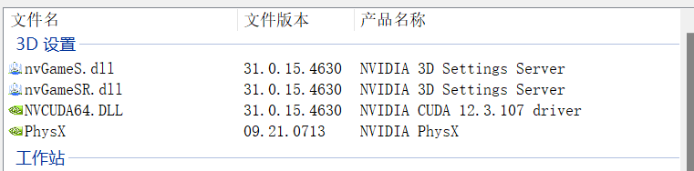
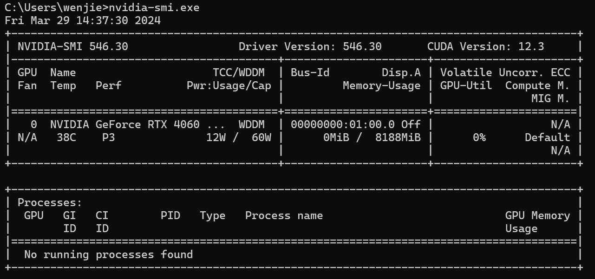

# 安装

## 确定安装版本

### 查看显卡支持的最高CUDA版本

我的电脑是拯救者Y9000P，有两种方式查看

- 通过英伟达设置可以观察到我的电脑最高支持到CUDA12.3.107



- 安装显卡驱动的前提下，在命令行输入:

  ```shell
  nvidia-smi.exe
  ```

  效果如图：



可以看到显示CUDA Version为12.3，说明该显卡最高支持到12.3，我这里就选择12.3的版本，你也可以选择更低的版本比如 11.5,11.4更低的版本。

### 确定CUDA版本支持的VS版本

查询官方安装文档，这里给出文档地址：https://docs.nvidia.com/cuda/archive/11.6.0/cuda-installation-guide-microsoft-windows/index.html

### 确定CUDA版本对应的cuDNN版本