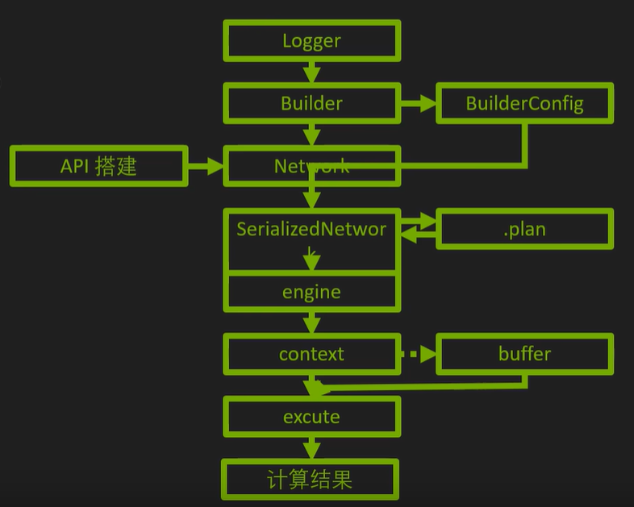
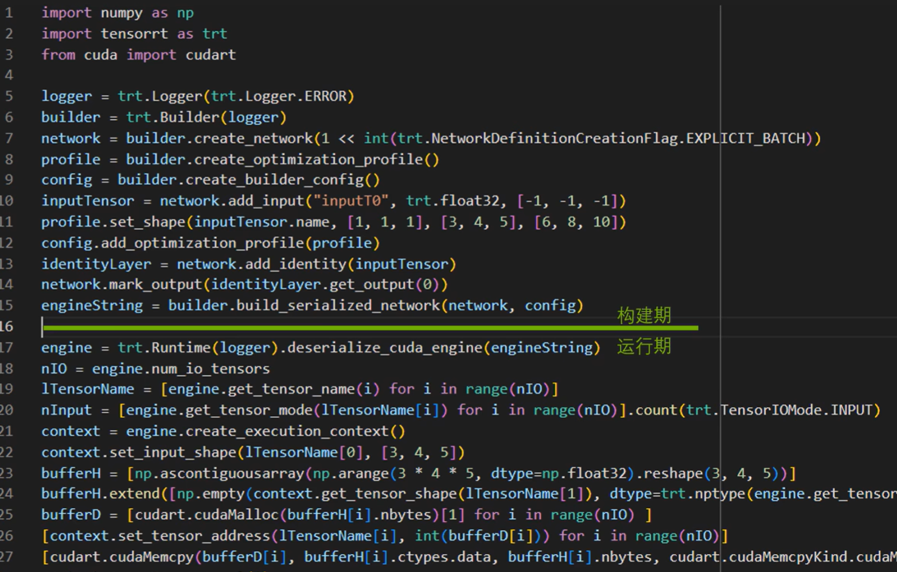
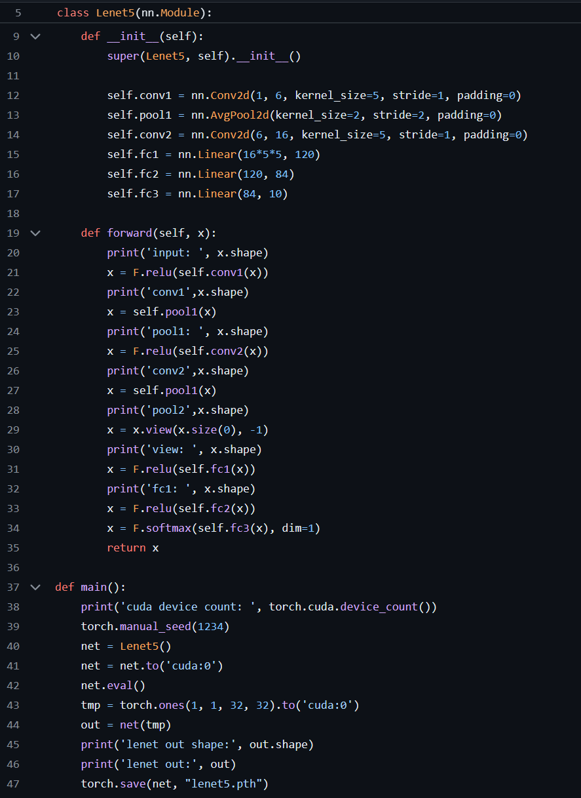
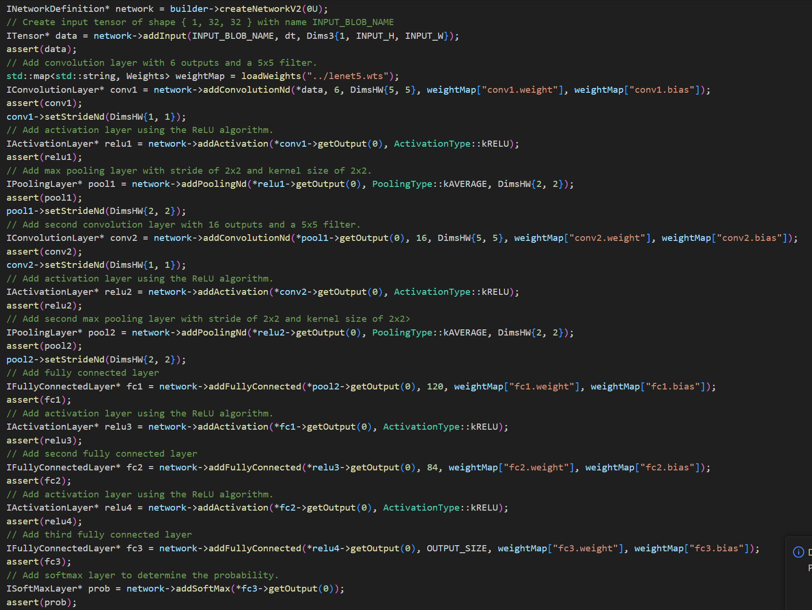
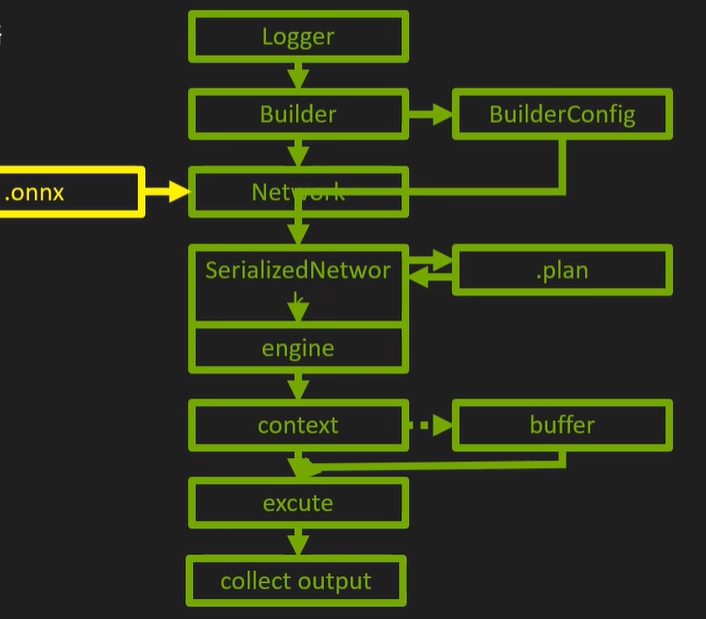

# 原理概述

## 实现加速步骤

### 构建期

- 模型解析与建立——加载Onnx等其他模型使用原生API搭建
- 计算图优化——横向层融合（conv），纵向层融合（conv+add+relu）
- 节点消除——去除无用层，节点变换
- 多精度支持——FP32/FP16/INT8/TF32
- 导入plugin——实现自定义操作
- 显存优化——显存池复用

### 运行期

- 运行时环境——对象生命期管理，内存显存管理，异常处理
- 序列化反序列化——推理引擎保存为文件或从文件加载

## 基本流程（代码层面）

### 构建期

- 前期准备：
  - 日志记录器：Logger
  - 计算图构建器：Builder
  - 构建器的配置器：Config
  - 动态模式下需要的配置器：Profile
- 创建计算网络Network（计算图内容）
- 生成序列化网络（计算图TRT内部表示）

### 运行期

- 建立计算图可执行程序Engine（可执行代码段），用来运行可执行程序的Context（类比CPU进程）
- Buffer相关准备（申请+拷贝）
- 执行推理（Execute）
- 善后工作

# 使用方法分类

- 使用框架自带TRT接口（TF-TRT,Torch-TensorRT）

  - 简单灵活，部署过程仍在在原框架中
  - 遇到不支持的算子：自动forback到原框架中进行计算

  - 开发效率高，性能与兼容性不足

- 使用Parser（TF/Torch->ONNX->TensorRT）
  - 通用性好，方便做网络调整，兼顾效率和性能
  - 遇到不支持的算子：修改网络，使用plugin补救

- 使用原生TensorRT API搭建网络

  - 性能最好，对网络进行精细控制
  - 兼容性最好
  - 易用性，开发效率低
  - 遇到不支持的算子：自己写CUDA C++完成plugin进行计算

  

  

## 1.原生API搭建

- TensorFlow/Pytorch训练模型

- 提取网络权重，进行保存

- TensorRT中逐层构建该网络并且加载模型权重
- 生成推理引擎
- 利用引擎进行实际推理

## 2.Parser导入onnx

tensorrt官方源码路径下有直接的转换工具，可以轻松的将onnx转换为trt序列化文件。