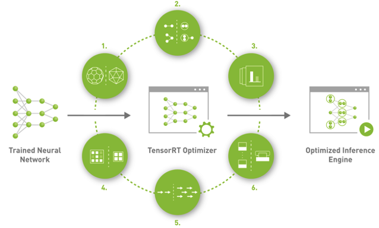
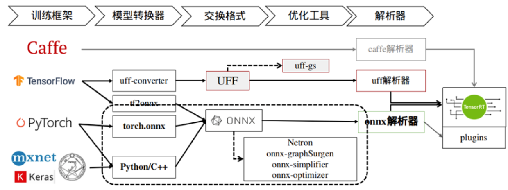

# 背景介绍

作用：模型加速

TensorRT，是Nvdia推出的一套专为深度学习推理打造的SDK。**在推理阶段，基于TensorRT的应用可以提供同比单一CPU平台高达40倍的加速效果。**TensorRT可以从所有主流的深度学习框架中导入训练好的模型并进行优化，同时提供相应的API和解析器(parser)，此外它还可以利用高精度对低精度进行校验。生成经过优化的运行时引擎可以部署到数据中心，车辆端和嵌入式环境中。

TensorRT主要包括一个深度学习推理的优化器(optimizer)和运行时(runtime)，可以为深度学习推理应用提供低延迟和高吞吐的特性。它支持C++和Pytorch两种代码方式。

TensorRT 是构建在NVIDIA的并行编程模型CUDA基础之上的，结合最新一代Ampere架构的GPU，TensorRT还可以利用Tensor Core实现稀疏性(Sparsity)加速的特点。对于深度学习推理应用的生产环境部署方面，TensorRT提供了INT8和FP16的优化，可针对视频流，语音识别，推荐领域，欺诈检测，自然语言处理等。低精度推理能够极大的降低应用的延迟，有益于实时服务，以及自动驾驶和嵌入式类型的应用。

官方详细开发者指南可参考：https://docs.nvidia.com/deeplearning/tensorrt/developer-guide



# 应用特点

- 支持混合精度

通过将模型量化为INT8最大化吞吐（支持PTQ和QAT两种量化方式）

- Layer和Tensor的融合

可以通过将多个节点融合为一个kernel来优化GPU显存和带宽的使用

- Kernel 的自动调节

基于目标GPU平台，选择最佳的数据层和算法

- Tensor 显存使用的动态化

最小化显存的使用，高效的反复利用显存存储tensor

- 多流执行

采用可扩展的设计可以并行的处理多个输入流

- 时间层面的融合

在时间步上利用动态生成的kernel优化了RNN（Recurrent Neural Network）

使用TensorRT的加速效果可参考：https://developer.nvidia.com/deep-learning-performance-training-inference#dl-inference

快速入门：https://developer.nvidia.com/blog/speeding-up-deep-learning-inference-using-tensorrt-updated/

# 相关概念

- onnx parser：onnx解析器，它可以将一个onnx模型解析成为TensorRT可以识别的深度神经网络。此外，TensorRT还可以通过手动搭建API的方式构建整个网络(Python API, C++ API)
- Builder: 该模块会接收TensorRT中的一个哇昂罗(?)，并生成一个针对目标平台优化好的TensorRT engine.
- Engine: Engine 会用来接收如数的数据，执行推理，并输出推理的结果。
- Logger：和Builder，Engine协同配合，在构建和推理过程中捕获errors，warning以及其它信息。

# 通用流程

1. 将通过原生框架(PyTorch, Paddle, TensorFlow等)预训练好的模型转成onnx格式。
2. 将onnx模型转入TensorRT
3. 应用优化器并生成一个TensorRT engine
4. 在GPU上执行推理过程



# 参考构建代码

```python
  import tensorrt as trt
    import pycuda.driver as cuda
    import pycuda.autoinit
    import onnx
    
    # 构建TensorRT Logger
    TRT_LOGGER = trt.Logger(trt.Logger.WARNING)

    # 创建一个builder
    builder = trt.Builder(TRT_LOGGER)

    # 构建network
    EXPLICIT_BATCH = 1 << (int)(trt.NetworkDefinitionCreationFlag.EXPLICIT_BATCH)
    network = builder.create_network(EXPLICIT_BATCH)

    # 构建network的配置
    config = builder.create_builder_config()
    #创建ONNX模型的解析器parser
    parser = trt.OnnxParser(network, TRT_LOGGER)

    # 将ONNX模型读入，并设定模型的执行配置
    model = open("/workspace/tensorrt/data/mnist/mnist.onnx",'rb')
    parser.parse(model.read())
    builder.max_batch_size = 1
    config.max_workspace_size = MiB(16)
    config.set_flag(trt.BuilderFlag.GPU_FALLBACK)

    # 构建engine
    engine = builder.build_engine(network,config)
```

构建玩的engine可以直接进行推理，也可以序列化后进行线上部署。

下一步创建上下文进行推理：利用上面创建好的engine，我们构建上下文，并进行执行操作。这其中涉及数据从<u>CPU读取到GPU显存</u>等。

```python
…
    context = engine.create_execution_context()
    …
    # 数据传入GPU等…
    …
    context.execute(batch_size = 1,bindings=buffers)
    # 数据传出GPU以及后续的操作等。
```

# 其他工具

## trrexec

trtexec 是一个命令行封装好的工具，主要用来在不部署应用的前提下快速使用TensorRT。

目的：

1）用来对随机数据进行基准的神经网络性能进行测试

2）从模型生成序列化好的engine。对于前期快速定位模型问题，性能测试，生成engine，神经网络性能，选择的优化路径等具有重要的指导意义。

参考：https://github.com/NVIDIA/TensorRT/tree/master/samples/trtexec

## **ONNX GraphSurgeon**

有些情况下，我们导出的ONNX模型需要做特殊的修改，那么ONNX GraphSurgeon就是一个可以用来对当前ONNX Graph进行修改的小工具，同时还可以轻松地生成新的ONNX Graph。

参考：https://github.com/NVIDIA/TensorRT/tree/master/tools/onnx-graphsurgeon

## **Polygraphy**

Polygraphy是一个用来在多种框架下，协助运行和调试深度学习模型的工具包。它包含了Python API和命令行调用两种使用方式。

此外，Polygraphy还可以实现如下的事情：

可基于TensorRT或ONNX-Runtime后端下运行推理，并比较它们的结果 转换模型为多种格式，比如具有PTQ量化的TensorRT engine 查看多种模型类型下的结果信息 基于命令行的方式修改ONNX模型 提取子图 模型简化与剪裁 在TensorRT中隔离有问题的tactics(注：TensorRT中通过遍历不同配置的kernel进而选择最佳的kernel的过程叫做tactic选择)

参考：https://github.com/NVIDIA/TensorRT/tree/master/tools/Polygraphy

# 参考博客

NVIDIA Jetson Nano 2GB系列文章（64）：将模型部署到Jetson设备http://nvidia.zhidx.com/content-6-2603.html

使用TensorRT加速深度学习推理https://cloud.baidu.com/doc/GPU/s/Ukt8jtjqx

