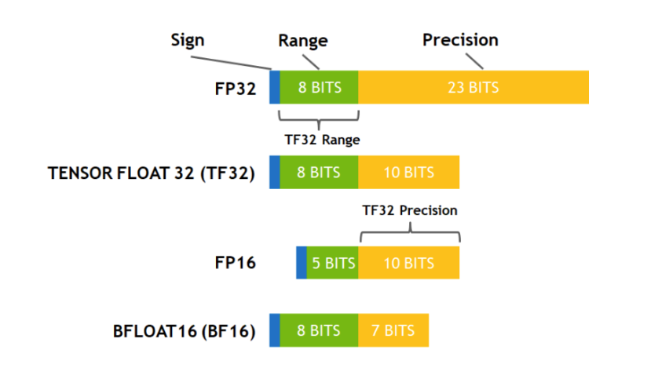
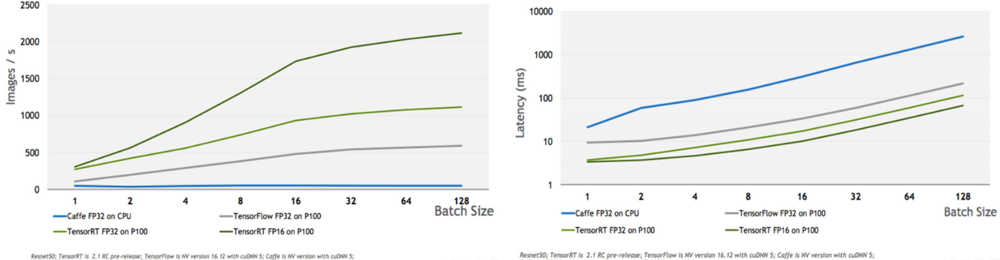
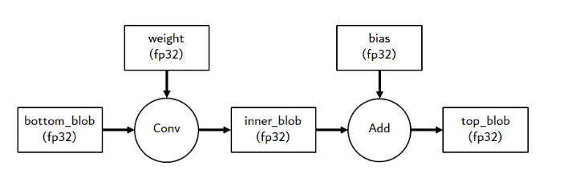
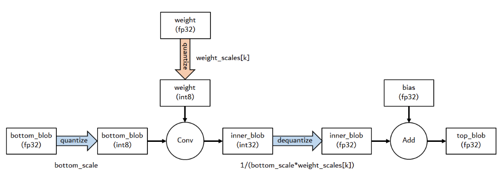
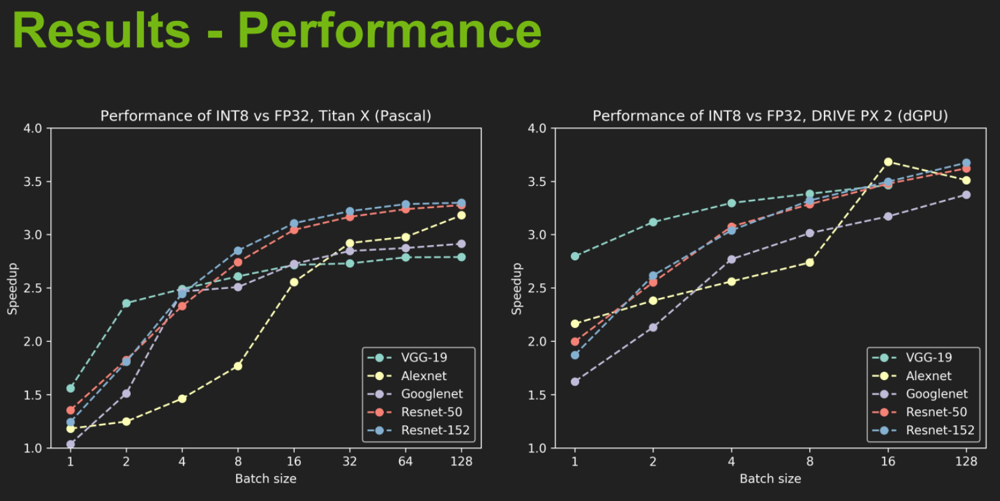
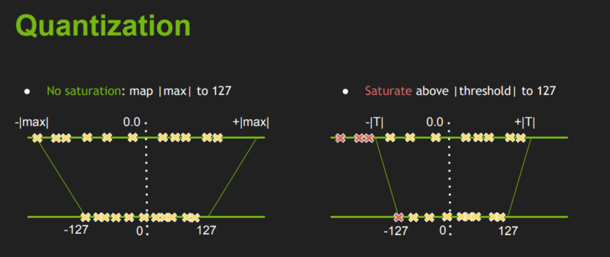

# 降低精度



默认情况下，TensorRT 以 32 位精度工作，但也可以使用 16 位浮点和 8 位量化浮点执行操作。 使用较低的精度需要更少的内存并实现更快的计算。

在构建器配置中设置标志会通知 TensorRT 它可能会选择较低精度的实现。

```python
config.set_flag(trt.BuilderFlag.FP16)
```

共有三个精度标志：FP16、INT8 和 TF32，它们可以独立启用。 请注意，如果 TensorRT 导致整体运行时间较短，或者不存在低精度实现，TensorRT 仍将选择更高精度的内核。

当 TensorRT 为层选择精度时，它会根据需要自动转换权重以运行层。

计算将使用与输入首选相同的浮点类型。 大多数 TensorRT 实现具有相同的输入和输出浮点类型； 但是，Convolution、Deconvolution 和 FullyConnected 可以支持量化的 INT8 输入和未量化的 FP16 或 FP32 输出，因为有时需要使用来自量化输入的更高精度输出来保持准确性。

设置精度约束提示 TensorRT 它应该选择一个输入和输出与首选类型匹配的层实现，如果前一层的输出和下一层的输入与请求的类型不匹配，则插入重新格式化操作。 请注意，如果使用构建器配置中的标志也启用了这些类型，则 TensorRT 将只能选择具有这些类型的实现。

默认情况下，TensorRT 只有在产生更高性能的网络时才会选择这样的实现。 如果另一个实现更快，TensorRT 会使用它并发出警告。 您可以通过首选构建器配置中的类型约束来覆盖此行为。

```python
config.set_flag(trt.BuilderFlag.PREFER_PRECISION_CONSTRAINTS)
```

如果约束是首选的，TensorRT 会服从它们，除非没有具有首选精度约束的实现，在这种情况下，它会发出警告并使用最快的可用实现。

# 使用FP16并没有提升速度

启用 FP16（半精度浮点数）精度通常是为了提高深度学习模型在 GPU 上的推理速度，因为 FP16 精度可以减少内存带宽的使用，并且可以在支持 FP16 计算的 GPU 上利用专门的 FP16 单元来加速计算。然而，在某些情况下，您可能会发现启用 FP16 后推理速度反而变慢了，这可能是由几个因素导致的：

1. **GPU 硬件支持**：确保您的 GPU 支持 FP16 计算。如果 GPU 硬件不支持 FP16，那么启用 FP16 不会带来任何性能优势，反而可能因为精度转换的开销而导致性能下降。
2. **批处理大小**：FP16 精度推理的性能提升在较大的批处理大小下更为明显。如果您使用的批处理大小较小，可能不会观察到显著的速度提升。
3. **模型和层的特定性**：某些层或操作可能无法充分利用 FP16 的优势。例如，一些层可能需要转换回 FP32 进行计算，这会引入额外的开销。
4. **内存带宽限制**：如果您的模型非常小，或者大部分时间都花在内存访问上，那么减少计算精度可能不会带来太大的性能提升。
5. **TensorRT 优化**：TensorRT 会尝试自动选择最优的算法和精度，如果您手动设置 FP16，可能会覆盖 TensorRT 的某些优化决策，导致性能下降。
6.    **数据转换开销**：在 FP16 和 FP32 之间转换数据可能会引入额外的开销，特别是如果模型中有些层或操作仍然需要 FP32 精度。
7. **系统资源限制**：系统上的其他限制，如 CPU 瓶颈、I/O 限制或内存限制，也可能影响推理速度。
8. **TensorRT 版本**：确保您使用的 TensorRT 版本是最新的，因为性能优化和 bug 修复通常包含在新版本中。
9. **混合精度支持**：某些模型可能需要混合精度支持（即某些层使用 FP16 而其他层使用 FP32），这可能需要更复杂的配置。
10. **调试和分析**：使用 TensorRT 提供的分析工具，如 `trtexec`，来理解性能瓶颈所在，并据此进行优化。

如果遇到性能问题，您可以尝试调整批处理大小、检查模型的 FP16 兼容性、使用 TensorRT 的性能分析工具来识别瓶颈，并考虑是否需要对模型或 TensorRT 配置进行调整。





FP32推理方式



INT8推理方式





